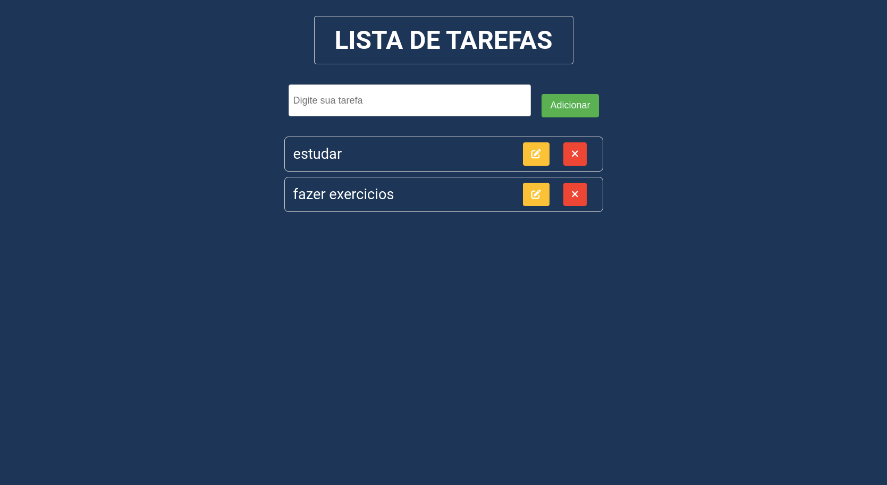

<h1 align="center">Lista de Tarefas</h1>

 

## :dart: About

Este projeto foi criado com o intuito de colocar em prática meus conhecimentos adquiridos sobre a Linguagem JavaScript.

###

## :sparkles: Features

:heavy_check_mark: adicionar uma tarefa;\
:heavy_check_mark: editar uma tarefa já salva;\
:heavy_check_mark: excluir uma tarefa;

###

## :rocket: Technologies

- HTML;
- CSS;
- JavaScript;

Made with :heart: by <a href="https://github.com/luisfelipecode" target="_blank">luis felipe</a>
